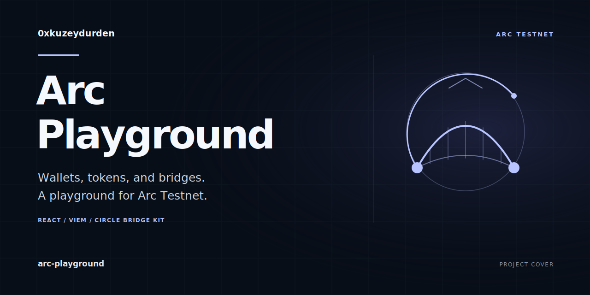

# Arc Playground

[](https://github.com/0xkuzeydurden/arc-playground/actions/workflows/ci.yml)



Explore Arc Testnet from one dashboard: connect a wallet, send GM/GN greetings, transfer test tokens, deploy ERC-20 and ERC-721 contracts, and use the Circle Bridge Kit interface.

Built with React, TypeScript, Vite, Tailwind CSS, and viem. [Run it locally](#run-locally) to explore the interface; wallet approval is required for onchain actions.

## Features

- Connect an injected browser wallet and request a switch to Arc Testnet.
- View the connected account's balance, network block number, and GM/GN counters.
- Send GM/GN greetings through the configured contracts.
- Transfer native testnet USDC to a recipient.
- Deploy the included minimal ERC-20 and ERC-721 contracts with a name and symbol.
- Request USDC bridging between the UI's Arc Testnet, Ethereum Sepolia, and Base Sepolia options; view bridge steps and explorer links.

## Run locally

Install Node.js and pnpm, then run:

```sh
pnpm install --frozen-lockfile
pnpm dev
```

To type-check and build the static app, then preview the build:

```sh
pnpm build
pnpm preview
```

The build output is `dist/`. The included [`netlify.toml`](netlify.toml) uses `pnpm build`, publishes `dist/`, and configures Node.js 20 and pnpm 9.12.1.

## Network and configuration

The main app is configured for **Arc Testnet**, chain ID **5042002**, with **USDC** as the native test token. RPC, WebSocket, explorer, faucet, and contract addresses are defined in [`src/web3.ts`](src/web3.ts). Bridge network options are defined in [`src/App.tsx`](src/App.tsx).

No environment variables or private keys are required by the current app. The network configuration is public client-side data. Use a browser wallet for signing; keep its private keys outside the project.

Transactions, contract deployments, and bridge operations require approval in the connected wallet.

## Project scope

This is an experimental testnet application. Use test tokens and review the network, recipient, and transaction request in your wallet. RPC, faucet, contract, and bridge availability depend on external services. The listed bridge options describe the implemented UI, not a guarantee that every route is currently available. No live transaction verification or production-readiness guarantee is implied.
